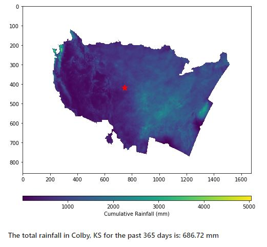
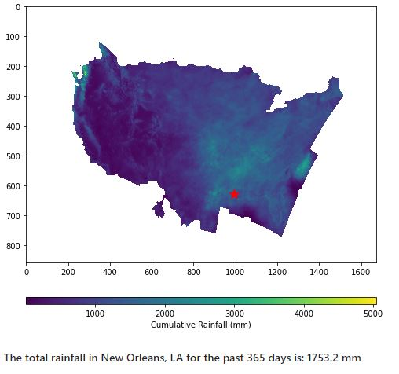

# A Python Code for Retrieving Rainfall at Ungauged Locations from Gridded Rainfall Products
##### Name: Nathaniel Parker
##### Research Area: Soil water Processes
##### Institution: Agronomy Dept., Kansas State Univerity 
##### Semester: Spring 2020

## Motivation
Rainfall measurement is important for monitoring environmental events such as drought and flooding. The stardard and direct technique for rainfall measurement is rain gauge. However, rain gauge provide point measurements at the location it is installed but is unable to measure rainfall over a large area as well as cannot give measuremets at ungauged locations (i.e. locations with no rain gauge). Radars and satellites give rainfall measurements on large spatial scale but at a coarse resolution (between 2 km and 450 km spatial resolution)(Hong et al., 2013). Also, radars and satellites are prone to errors because they measure rainfall indirectly from signal reflectivity (Brocca et al., 2019). Owing to the limitations of the various rainfall measurement techniques, the use of multi-sensor gridded rainfall products have become in deriving rainfall measurements over a large area (Lawrence et al., 2003). Multi-sensor gridded rainfall products are derived by combining rainfall records from rain gauge, radars and satellites into a single map of gridded rainfall data. 

Weather-monitoring agencies such as the National Weather Service have made it easy to obtain gridded rainfall data through their websites, however, it is complicated to retrieve point rainfall measurements from gridded poducts for any given location since such activity requires great experience in data processing with Geographic Information Systems (GIS) softwares. There is therefore a need for a simple method for retrieving rainfall measurements at ungauged locations (point measurements) from gridded rainfall products to aid decision-making. This project presents a python code for retrieving rainfall data at an ungauged location from the National Weather Service’s multi-sensor rainfall product using the latitude and longitude of that location as the only input. 

## Objective 
Create a python code for retrieving rainfall measurements at ungauged locations (point measurements) from gridded rainfall products. 

## Methodology
The data for this project was obtained from the National Weather Service's (NWS) multi-sensor gridded rainfall product. The NWS gridded rainfall products are available in hourly, daily, monthly, and yearly time intervals. The products are accessible via https://water.weather.gov/precip/download.php. 
Here, a single rainfall map (in GeoTiff format) of rainfall records for the last 365 days before April 26, 2020, for contiguous USA was used as an example data file to set up this code. However, the code should be compatible with GeoTiff files from other sources. In addition, the code can be easily modified to process multiple maps at a single run (i.e. stacked maps).

The steps followed in this project are outlined in Figure 1 below. Note: this project does not cover how to download gridded rainfall product and thus it is assummed that you have obtained the gridded data (.Tiff file) prior to using the procedure outlined below.

#### Sketch

Figure 1. Steps to retrieving a rainfall reading at a given location (point measurement) from gridded rainfall map. 

#### Test Locations and Results
##### Colby, KS: latitude = 39.396, longitude = -101.052 

##### New Orleans, LA: latitude = 29.951 , longitude = -90.071

## Outcome 
Derived rainfall measurement for some ungauged locations in contiguous US using the location's latitude and longitude. 

## References
Brocca, L., Filippucci, P., Hahn, S., Ciabatta, L., Massari, C., Camici, S., Schüller, L., Bojkov, B. and Wagner, W., 2019. SM2RAIN-ASCAT (2007–2018): Global daily satellite rainfall from ASCAT soil moisture. Earth Syst. Sci. Data Discuss, pp.1-31.

Hong, Y., Adhikari, P. and Gourley, J.J., 2013. Flash flood. Encyclopedia of natural hazards, pp.324-325.

Lawrence, B.A., Shebsovich, M.I., Glaudemans, M.J. and Tilles, P.S., 2003, February. Enhancing precipitation estimation capabilities at National Weather Service field offices using multi-sensor precipitation data mosaics. In Preprints, 19th Conf. on IIPS, Long Beach, CA, Amer. Meteor. Soc (Vol. 15).