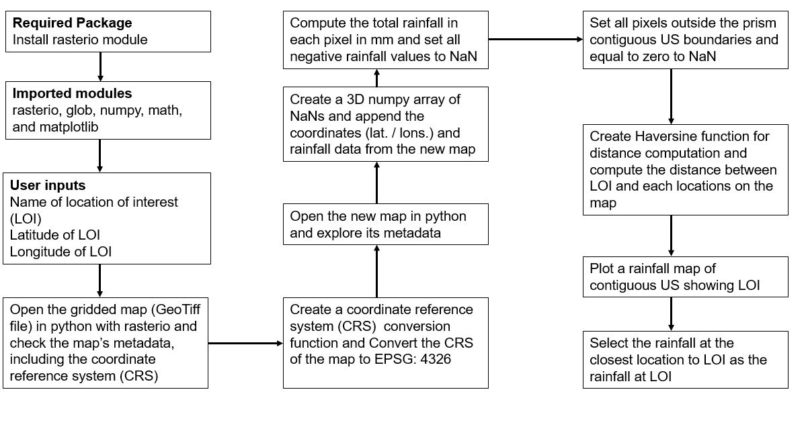

# A Function for Retrieving Rainfall Data from Weather Radar
## Nathaniel Parker, KSU Dept. of Agronomy, Manhattan, KS

## Motivation
Rainfall is the main source of water for plants, animals and humans and doubles as the input variable in the soil water balance. Accurate rainfall measurement is important for monitoring environmental events such as drought and flooding. Rainfall measurement is typically done using a rain gauge, which only gives a point measurement. In recent times, there is increased interest in rainfall measurement on a large spatial scale and thus radar data has become very useful in undertaking this purpose. Although many weather-monitoring agencies such as the National Weather Service make their data freely available for download through their websites, the process is often complicated and the data is usually not cleaned. There is therefore a need to derive for a function which will simplify the data retrieval process and provide a clean data which is ready for use.

## Objective 
Create a python function to retrieve a clean rainfall data from the National Weather Service’s weather radar

## Outcome 
I want to create a .csv file with a clean radar-derived rainfall data for a particular location. 

## Sketch
